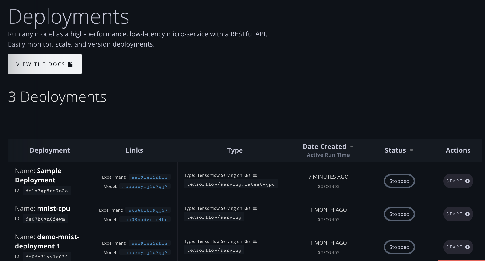

# Create a Deployment via the UI

## Create a Deployment

Deployments can be created through the Paperspace web console. They can be found under the "Deployments" tab of any Project. A list of all deployments across projects can be found by clicking Deployments tab on the side nav. 

### Navigate to your Models list

### Select the model & click "Deploy Model"

### Choose a machine type to run the Deployment

In section **1. Choose Machine**, select the GPU or CPU machine type to run your Deployment.

The following section shows the region of the selected machine and where the Deployment will be served from:

### Input Parameters for the Deployment

In section **2. Name**, add a name for your deployment, such as `Sample Deployment`.

In section **3. Base Image,** use the `tensorflow/serving:latest-gpu` container, which is selected by default. ****As both CPU & GPU serving are available, be sure to select the container corresponding to your selected machine type and what your Model was optimized for. Only TensorFlow Serving can be selected as base image \(support for any base image will be available for serving soon\).

In section **4. Instance Count**, select the number of instances to run the Deployment on.

Below we chose 2, meaning there will be 2x K80 GPU instances backing this Deployment. Load balancing is provided for all multi-instance deployments.

In section **5. Command,** choose a command run at container launch, if applicable.

_Note: for the TensorFlow Serving base container used here, the command to run the job is unnecessary. This option can be changed when choosing a different base image to deploy on._

### Active Deployment vs Inactive Deployment

In the above example, we created an Active Deployment \(selected by default\), which means that it will be created and then will run automatically. You can also choose to create an  Inactive Deployment as well. You are only charged for Deployments when they are running.

Finally, now that your Deployment is configured, click "Create Deployment" to create it.

### Viewing, Starting, and Stopping Deployments

Navigating to the Deployments tab, you can see your list of Running and Stopped deployments. Here we have 3 Deployments:

Each Deployment has its own unique ID and is associated with the Experiment and Model it was created from. Click "Start" to launch the Deployment. A Running Deployment and its details \(found by clicking the row\) will appear as follows:

Each Deployment has its own unique RESTful API. Inference can be performed via the shown endpoint: `https://services.paperspace.io/model-serving/<your-model-id>:predict`.

The number of running instances and the instance count are visible as well.

Congrats, you've created a Deployment and can perform inference!

[Learn more about a Deployment's RESTful API here](deployment-restful-api.md).

