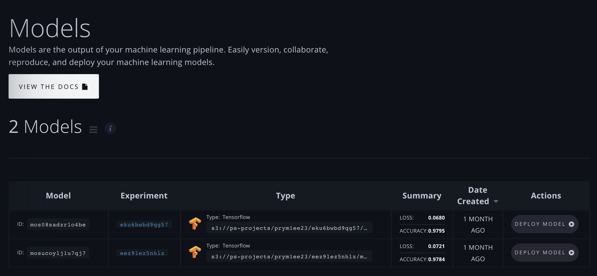
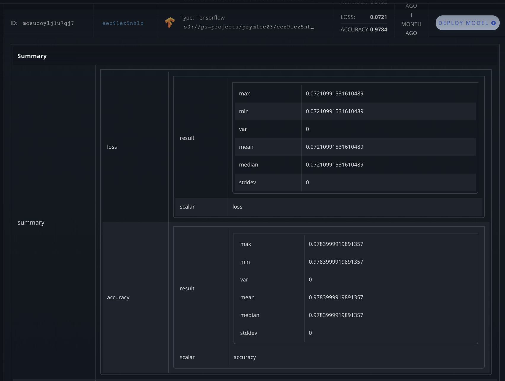
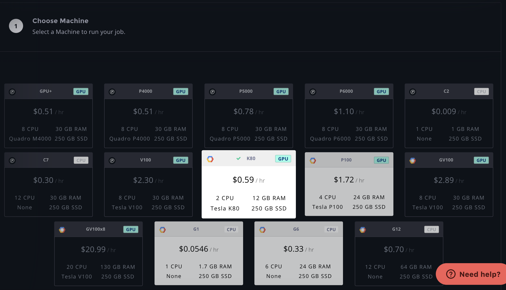
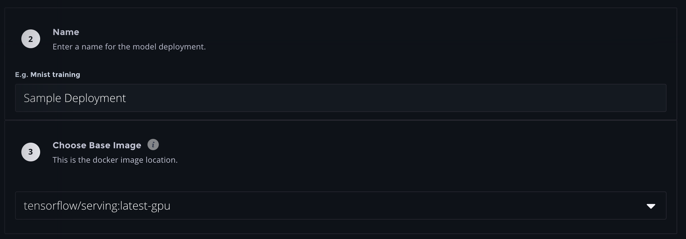
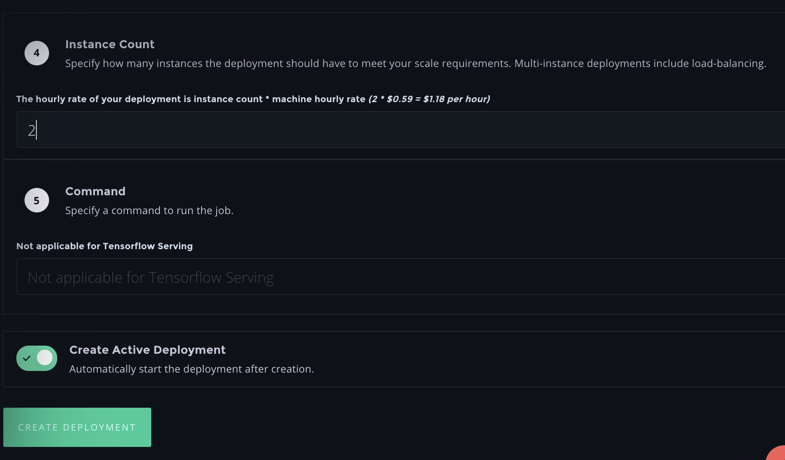
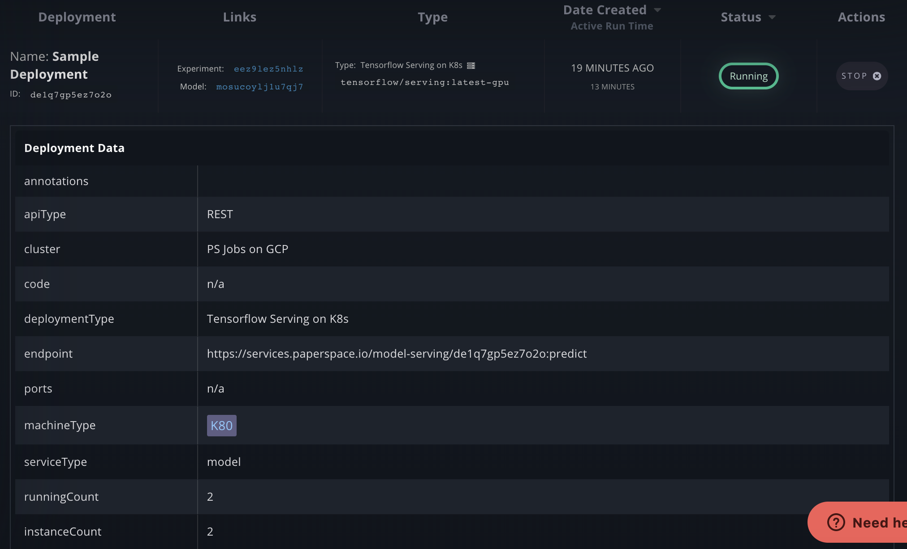

# Create a Deployment via the UI

## Create a Deployment

Deployments can be created through the web console. Deployments can be found under the `Deployments` tab of any Project. A list of all deployments across projects can be found in the `Deployments` tab on the sidebar. 

### Navigate to your trained models

### Select the model & click deploy

### Choose a machine type to run the deployment

The following block shows the region of the selected machine  & where the deployment will be served out of

### Input Parameters for the deployment

**2. Name: Here we select a name of "Sample Deployment"** 

**3. Base Image: We use the tensorflow/serving:latest-gpu container, which is selected by default.** As both CPU & GPU serving is available, make sure to select the container corresponding to selected machine type & what your model was optimized for. Only tensorflow serving can be selected as base image \(support for any base image will be available for serving soon\).

#### 4. Instance Count: Select the number of instances to run the deployment on. 

Here we chose 2, meaning there will be 2 K80 GPU instances backing this deployment. Load balancing is provided for all multi-instance deployments.

#### 5. Command to run at container launch

For the Tensorflow Serving base container used here, the command to run the job is unneeded. This becomes available to those choosing a different base image to deploy on.

### Active Deployment vs Inactive Deployment

In the above example, we chose to create an active deployment \(selected by default\). You can also choose to create a deployment but not activate it. You are only charged for active deployments.

### Deploying

Navigating to the deployments tab, you can see your list of active & inactive deployments. Here we have 3 deployments. 

Each deployment has its own unique ID & is associated with the Experiment & Model it was created from. Clicking Start will launch the deployment

Each deployment has its own unique endpoint which can be accessed via REST at https://services.paperspace.io/model-serving/\[your-model-id\]:predict

The number of running instances & the instance count are visible as well.

