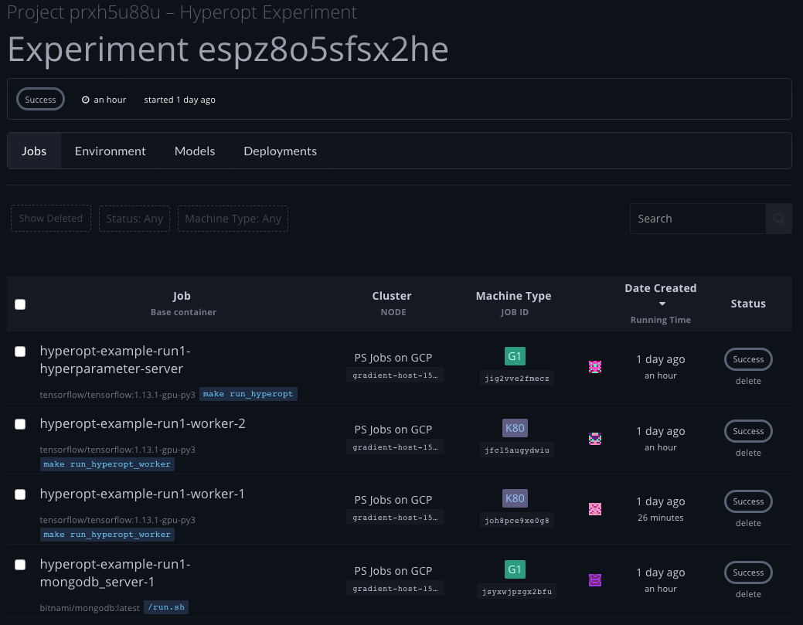
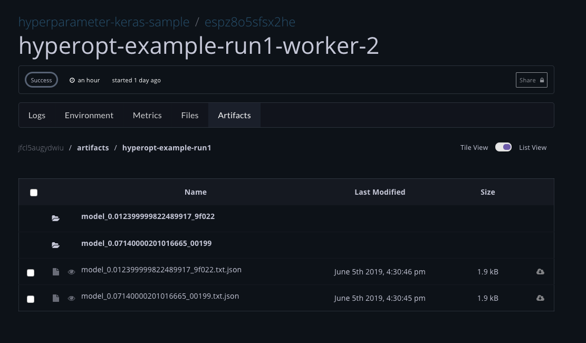

# Hyperparameter Tuning

## About


This feature is in beta. 


Gradient provides users the ability to tune hyperparameters for their machine learning models, harnessing the power of our cloud to explore different model configurations and discover an optimal model.

##  How it works?

Paperspace Hyperparameter Tuning based on [_Hyperopt_](http://hyperopt.github.io/hyperopt/)\_\_

Hyperopt is a method for searching through a hyperparameter space. For example, it can use the Tree-structured Parzen Estimator \(TPE\) algorithm, which intelligently explores the search space while narrowing down to the best estimated parameters.

It is thus a good method for meta-optimizing a neural network. Whereas a neural network is an optimization problem that is tuned using gradient descent methods, hyperparameters cannot be tuned using gradient descent methods. That's where Hyperopt comes in and shines: it's useful not only for tuning hyperparameters like learning rate, but also for tuning more sophisticated parameters, and in a flexible way: it can change the number of layers of different types; the number of neurons in one layer or another; or even the type of layer to use at a certain place in the network given an array of choices, each themselves with nested, tunable hyperparameters.

This kind of Oriented Random Search is Hyperopt's strength, as opposed to a simpler Grid Search where hyperparameters are pre-established with fixed-step increases. Random Search for Hyperparameter Optimization has proven to be an effective search technique. The paper about this technique sits among the most cited deep learning papers. In summary, it is more efficient to randomly search through values and intelligently narrow the search space, rather than looping on fixed sets of hyperparameter values.

If you want to learn more about Hyperopt, you'll probably want to [watch this video](https://www.youtube.com/watch?v=Mp1xnPfE4PY), made by the creator of Hyperopt

#### How to define Hyperopt parameters

A parameter is defined with either a certain uniform range or a probability distribution, such as:

```text
hp.randint(label, upper)
hp.uniform(label, low, high)
hp.loguniform(label, low, high)
hp.normal(label, mu, sigma)
hp.lognormal(label, mu, sigma)
```

There are also a few quantized versions of those functions, which round the generated values at each step of "q":

```text
hp.quniform(label, low, high, q)
hp.qloguniform(label, low, high, q)
hp.qnormal(label, mu, sigma, q)
hp.qlognormal(label, mu, sigma, q)
```

It is also possible to use a "choice" that can lead to hyperparameter nesting:

```text
hp.choice(label, ["list", "of", "potential", "choices"])
hp.choice(label, [hp.uniform(sub_label_1, low, high), hp.normal(sub_label_2, mu, sigma), None, 0, 1, "anything"])
```

## Hyperparameter made easy with [Gradient-SDK](https://github.com/Paperspace/gradient-sdk)

**hyper\_tune\(\)**

Function to run hyperparameter tuning.

It accepts the following arguments:

* `train_model` User model to tune.
* `hparam_def` User definition \(scope\) of search space. To set this value, refer to [hyperopt documentation](https://github.com/hyperopt/hyperopt).
* `algo` Search algorithm. _Default_: `tpe.suggest` \(from hyperopt\).
* `max_ecals` Maximum number of function evaluations to allow before returning. _Default_: `25`.
* `func` Function to be run by hyper tune. _Default_: `fmin` \(from hyperopt\). _Do not change this value if you do not know what you are doing!_

It returns a dict with information about the tuning process.

It can raise a `ConfigError` exception with message if there's no connection to MongoDB.

**Note:** _You do not need to worry about setting your MongoDB version; it will be set within Paperspace infrastructure for hyperparameter tuning._

**Usage example:**

```text
from gradient_sdk import hyper_tune

# Prepare model and search scope

# minimal version
argmin1 = hyper_tune(model, scope)

# pass more arguments
argmin2 = hyper_tune(model, scope, algo=tpe.suggest, max_evals=100)
```

## How to perform Hyperparameter search on Paperspace

Everytime you create a hyperparameter tuning experiment we create at least 3 jobs:

1. Hyperparameter Server that will run your tuning command
2. n amount of workers that will run jobs
3. mongoDb server to store job results

### Using the gradient CLI

Assuming that you have configured an API Key for the paperspace cli enter:

```text
gradient hyperparameters run \
  --name HyperoptKerasExperimentCLI1 \
  --projectId <your-project-id> \
  --tuningCommand 'make run_hyperopt' \
  --workerContainer tensorflow/tensorflow:1.13.1-gpu-py3 \
  --workerMachineType K80 \
  --workerCommand 'make run_hyperopt_worker' 
  --workerCount 2 \
  --workspaceUrl git+https://github.com/Paperspace/hyperopt-keras-sample
```

On successfully creating a hyperparameter experiment it should return something like this:

```text
Hyperparameter created with ID: <experiment_id> and started
```



For workers and parameter server you can easily access the logs and outputs of the various tasks. 



## Comparing various runs on Paperspace


This feature is coming soon to our platform!


