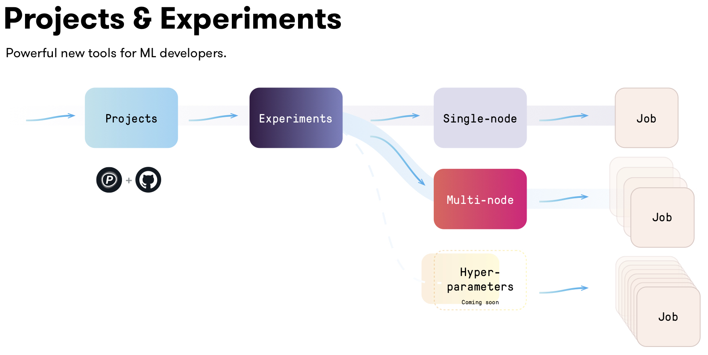

# Core Concepts

## Projects

A Gradient Project is a collection of experiments, code, metrics, and artifacts. Projects can be created manually or automatically from a Job corresponding to the current working directory name.

 

## Jobs

The [Gradient Jobs](https://www.paperspace.com/console/jobs) are designed for executing code \(such as training a deep neural network\) on a cluster of GPUs without managing any infrastructure.

Jobs are part of a larger suite of tools that work seamlessly with Gradient Notebooks, and our Core product, which together form a production-ready ML/AI pipeline.

#### A Job consists of:

1. a collection of files \(code, resources, etc.\) from your local computer or GitHub
2. a container \(with code dependencies and packages pre-installed\)
3. a command to execute \(i.e. python `main.py` or `nvidia-smi`\)

## Notebooks

A Notebook is an interactive coding environment that allows you to mix code or formulas with text and diagrams, visualizations, and other media. Notebooks make it easy to explore data and coding concepts, and collaborate with other people on projects. Gradient integrates with Jupyter Notebooks and Jupyter Lab, making it easy to get a coding environment provisioned in seconds.

## Data

### Persistent Storage

Persistent storage is a separate area where you can read and write files while using a Job or a Notebook. You can also read and write data from your Workspace, but as the name indicates, persistent storage persists across job runs. Persistent storage is backed by a filesystem and is ideal for storing data like images, datasets, model checkpoints, and more. Learn more about persistent storage [here.](https://support.paperspace.com/hc/en-us/articles/360001468133-Persistent-Storage)

### Artifact Storage

Artifact storage is collected and made available after the job run in the CLI and web interface. You can find the Artifacts in the Paperspace console by going to the Gradient° Job Runner, clicking on the job run, and scrolling to the bottom of the output. From there you can download any files that your job has placed in the `/artifacts` directory. If you need to get result data from a job run out of Paperspace, use the Artifacts directory.

The total of Workspace storage and Artifact storage cannot exceed the available storage on the host machine \(about 2 terabytes\). If you think you will write enough files to fill this up, be sure to check for errors from the OS.

### Workspace Storage

The Workspace storage is typically imported from the local directory in which you started your job. The contents of that directory are zipped up and uploaded to the container in which your job runs. The files are copies of the files on your local machine.

The Workspace exists for the duration of the job run. This directory is the current working directory in which your job is started, and is located at `/home/paperspace` if you need to reference the absolute path. If you need to push code up to Paperspace and run it, using the Workspace storage is the way to do it.

## Models

Coming soon!

## Deployments

Coming soon!

