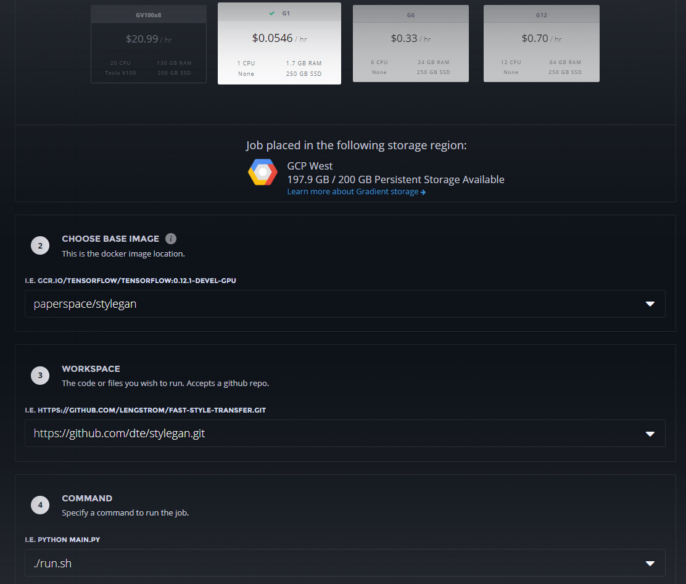

# Quick Start

## Prerequisites 

1. [Create a Paperspace account ](https://www.paperspace.com/account/signup)
2. [Install the Paperspace CLI ](../cli/install-the-cli.md#installation)
3. [Connecting your account](../cli/install-the-cli.md#connecting-your-account)

## Create a Notebook

Notebooks 

## Submit an Experiment

You can run Experiments from the web interface or CLI:

### Interface



### CLI

```bash
paperspace-python experiments createAndStart singlenode --projectHandle prj0ztwij --container Test-Container --machineType P4000 --command "nvidia-smi --name test-01
```

Your Experiment will get uploaded to our cluster of machines. Behind the scenes, we are creating a Docker container, and running the command you provided. There are several optional Experiment parameters.  See the full list [here](../jobs/create-a-job.md#job-parameters).

## Monitor your Job progress

Job states go from **Queued** &gt; **Pending** &gt; **Running**

Once the Job is in a **Running** state, you can watch your Job run in the CLI and web UI. For example, you should see the output of `nvidia-smi` by running `paperspace jobs logs --tail`. 

A Job can complete with the following states: **Success**, **Cancelled**, or **Error**.

 Congratulations! You ran your first job on Gradient 🚀

Jobs have a ton of functionality that this quick example doesn't cover.  To learn more, view the [Jobs section](../jobs/create-a-job.md).

